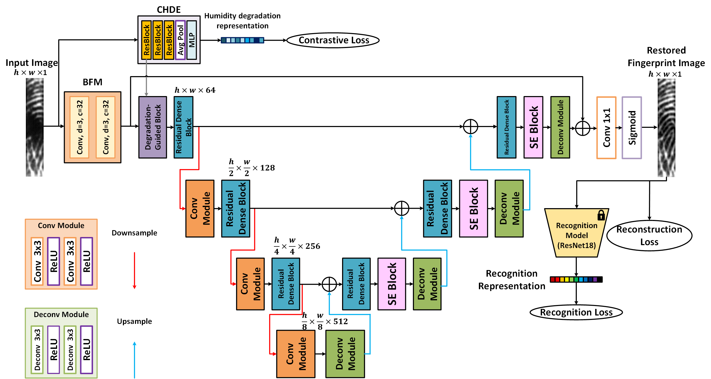
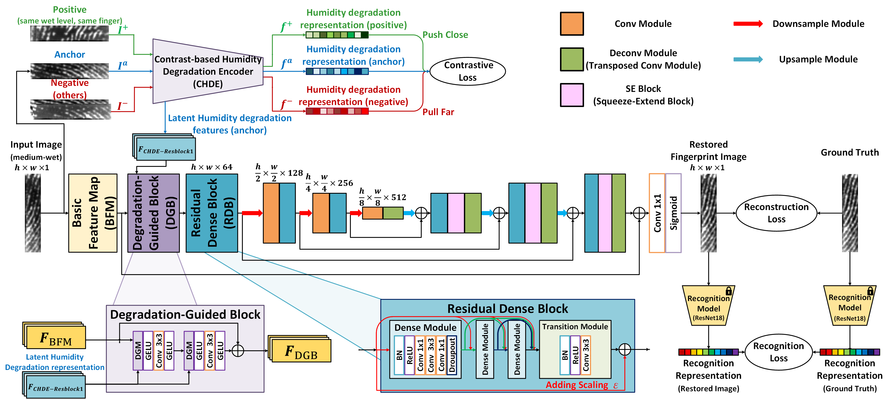
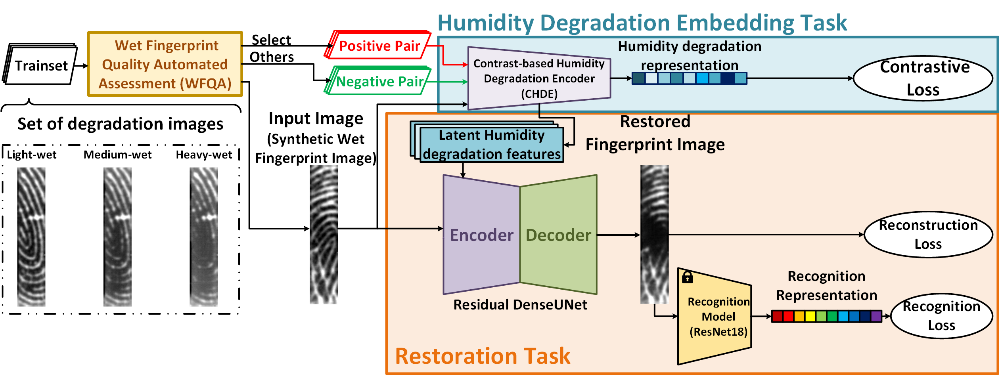

# AiRDUNet

by 111062574 Jui-Min Hsu

## reference paper
- DenseUNet: [Latent fingerprint enhancement based on DenseUNet](https://ieeexplore.ieee.org/document/8987279)
    - 2019, international conference on biometrics (ICB). IEEE
    - [reference github](https://github.com/tensorflow/examples/blob/master/tensorflow_examples/models/densenet/densenet.py)
- Residual Dense Block: [DenseNet with Deep Residual Channel-Attention Blocks for Single Image Super Resolution](https://openaccess.thecvf.com/content_CVPRW_2019/papers/NTIRE/Jang_DenseNet_With_Deep_Residual_Channel-Attention_Blocks_for_Single_Image_Super_CVPRW_2019_paper.pdf)
- AirNet: [All-In-One Image Restoration for Unknown Corruption](https://openaccess.thecvf.com/content/CVPR2022/papers/Li_All-in-One_Image_Restoration_for_Unknown_Corruption_CVPR_2022_paper.pdf)
## architecture
- Architecture

- Overflow

- Multi-task Learning

## Environment Setup
```shell
conda create -n airdunet_torch python=3.10.8
conda install -c anaconda pip
pip install --upgrade pip
# nvidia-smi->看CUDA Version去挑
# https://pytorch.org/get-started/previous-versions/
conda install pytorch==1.12.0 torchvision==0.13.0 torchaudio==0.12.0 cudatoolkit=11.3 -c pytorch
pip install opencv-python
conda install -c conda-forge tqdm
pip install pyyaml
pip install torchsummary
pip install matplotlib
pip install -U scikit-learn
pip install pytorch-msssim
pip install pandas
pip install scikit-image
pip install thop
pip install torchviz
```
## Usage
- build dataset csv (trainset & valset & testset)
```py
# in build_dataset_csv.py
# set image size need to be saved in csv
input_img_shape = (176, 36) # (176, 36) or (36, 36)
# set your dataset folder path containing train and val subfolder
input_root_path = fr"/local/SSD1/focal_tech/datasets/n9395_1023_v1_cyc_v2/"
# set your inference/test set folder path containing identify and enroll subfolder
testset_input_path = fr"./inference_for_all_epoch/testset_nasic9395_v10.4/"
```
```shell
python preprocess/build_dataset_csv.py
```
- set config
```yaml
# set the following folder path to your path
Training:
  dataset_path: "/local/SSD1/focal_tech/datasets/n9395_1023_v1_cyc_v2/" # set your dataset folder path containing train and val subfolder
  root_path: "./model_record/result/${Model.name}" # set your model checkpoint result path
Testing:
  root_path: "./model_record/testing/${Model.name}" # set your test path which saves the visualized imaged during training process and the loss image
  dataset_dir: "/local/SSD1/focal_tech/datasets/testset_nasic9395_v10.4/" # set your inference/test set folder path containing identify and enroll subfolder
  result_dir: "./inference_for_all_epoch/testset_nasic9395_v10.4/${Model.name}/" # set your result folder path which saves the restored images from dataset_dir folder
```
- train
```yaml
# in config
Training:
  training: True
```
```shell
## use gpu ##
CUDA_VISIBLE_DEVICES=<gpu_id> python train_cl.py -c config/config.yaml
## use cpu only ##
python train_cl.py -c config/config.yaml
```
- inference
```yaml
# in config
Testing:
  testing: True
  inference_all_epoch_mode: True # if True, all the checkpoint will be saved
```
```shell
## use gpu ##
CUDA_VISIBLE_DEVICES=<gpu_id> python train_cl.py -c config/config.yaml
## use cpu only ##
python train_cl.py -c config/config.yaml
```
## note
- Runnable virtual environment dependency setting can be seen in "./dense_torch_env.yaml"
- My best epoch are saved in './weight/residual_denseunet_air_recog_n9395_1023_v1_cyc_v2_24_0807_0728_epoch_ft_118.pth'