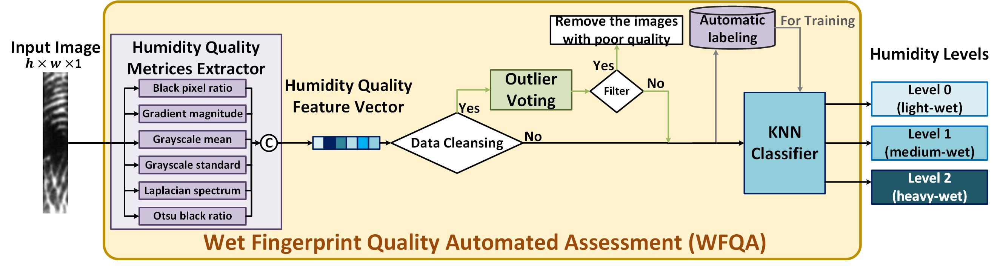
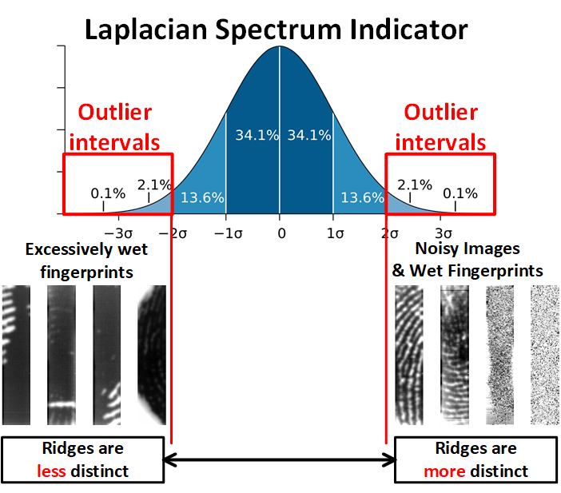

# WFQA
by 111062574 Jui-Min Hsu

## reference paper
- [Tiny Partial Fingerprint Sensor Quality Assessment](https://ieeexplore.ieee.org/stamp/stamp.jsp?tp=&arnumber=10496824)

## overview
- overview flow chart


- outlier example



## Usage

- generate KNN pretrained dataset
```py
# in generate_wet_quality_trainset.py
# set the path you need to build as humidity quality dataset
img_folder = fr""
# set the result path
result_folder = fr""
```
```shell
python generate_wet_quality_trainset.py
```

- evaulate wet fingerprint humidity quality
```py
# in estimate_metrices.py
# whether to remove poor quality images
REMOVE_BAD = False
# whether to copy file
COPY_FILE = False

# set the path you need to build as humidity quality dataset
img_folder = fr""
# knn pretrained dataset folder
knn_trainset_folder = fr"./knn_trainset/"
# result folder for bad quality images
bad_q_folder = fr""
# result folder for classifying humidity level
result_folder = fr""
```
```shell
python estimate_metrices.py
```